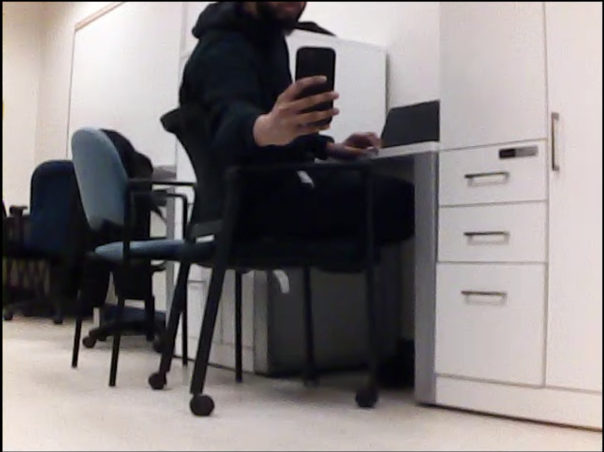

# Results

This chapter reports the results of evaluating the implemented system. The evaluation is drawn from two complementary sources: qualitative end-to-end testing of the unified pipeline on the real robot, and per-subsystem functional verification carried out throughout development. Because the project targets system-level integration rather than a single algorithmic contribution, the results in this chapter are organized around what each pipeline stage was observed to do rather than around comparing two machine-learning models.

## Description of the Subsystems Evaluated

Two path planners, one perception pipeline, and one task-execution state machine were implemented and evaluated in this project.

**A\* grid planner.** An 8-connected grid search with an octile-distance heuristic, operating on the 2D log-odds occupancy grid after obstacle inflation by 0.15 m. Paths are smoothed with a five-cell moving-average filter before publication. Serves as the fallback planner in the unified node.

**RRT\* sampling-based planner.** Tree-based search with goal biasing (probability 0.1), a 0.25 m step size, and asymptotic-optimality rewiring. Serves as the primary planner in the unified node.

**Arm-camera perception pipeline.** A three-position arm-sweep (45°, 90°, 135°) with YOLOv8 nano inference on each captured frame at a confidence threshold of 0.40, followed by LiDAR-fused bearing estimation to convert the highest-confidence detection into a world-frame goal.

**Task state machine.** The IDLE → SCANNING → NAVIGATING → INTERACTING → DONE / FAILED finite-state machine that drives the pipeline in response to `/task` messages.

## Performance Metrics

The evaluation uses three groups of metrics.

For the planner comparison:

- **Waypoint count** — number of points in the returned `/planned_path`. Fewer is generally better because it simplifies execution.
- **Path length (m)** — sum of Euclidean distances between consecutive waypoints.
- **Planning time (s)** — wall-clock time from the moment the goal is published to the moment `/planned_path` is published.

For the perception pipeline:

- **Detection rate per sweep position** — whether YOLOv8 returned any detection matching the target label at each of the three arm positions.
- **Detection confidence** — the confidence score returned by YOLOv8 for the selected target bounding box.
- **Object world-pose estimate** — the $(x, y)$ coordinate produced by the bearing-estimation formula, given for qualitative review against known room geometry.

For the end-to-end system:

- **Pipeline stage reached** — the final state that each task execution reached (SCANNING, NAVIGATING, INTERACTING, DONE, or FAILED), together with the stage at which execution stopped if the run did not complete.

## End-to-End Pipeline Test

A representative end-to-end test was carried out on 20 April 2026, with the robot accessed remotely via RustDesk. The startup sequence described in Chapter 2 was executed in order: `display_X3.launch.py`, `Mcnamu_driver_X3`, `base_node_X3` (from the `yahboomcar_base_node` package), and then the unified `main.py` node.

At startup, the unified node reported that all three optional subsystems loaded successfully:

```text
=======================================================
  UnifiedMainNode ready
  SLAM     : slam_module.py
  Primary  : RRT*
  Fallback : A*
  Camera   : YES
  YOLO     : YES
  Arm      : YES
=======================================================
```

Two hardware-configuration issues had to be resolved to reach this state, both of which are now documented in the project repository:

1. The `CAM_INDEX` parameter in `main.py` defaulted to 1, which does not correspond to a capture device on this Jetson image (OpenCV reports "Device `/dev/video1` is not a capture device"). Changing the parameter to 0 allowed `Rosmaster_Camera` to open the wrist camera. This is consistent with the `/dev/video0` device mapping documented in Chapter 2.
2. The `ARM_HOME` pose, originally `[90, 90, 90, 90, 90, 90]`, left the arm pointing vertically upward with the wrist camera oriented at the ceiling. All three sweep positions therefore captured images of the ceiling, and YOLOv8 returned no detections. Changing the home pose to `[90, 115, 25, 45, 90, 90]` adjusted the shoulder, elbow, and wrist-pitch servos in combination, directing the camera toward the room rather than the ceiling. Tuning more than one joint proved necessary because the arm's kinematic chain means a shoulder-only tilt leaves the wrist pointed at an unhelpful angle. Subsequent runs produced detections immediately.

### Observed pipeline execution

After the two fixes above, the task `"chair"` was published:

```
ros2 topic pub /task std_msgs/String "{data: 'chair'}" --once
```

The unified node logged the following trace (timestamps abbreviated):

```
[TASK] Received: 'chair'
[TASK] Searching for: ['chair']
[STATUS] Scanning for: ['chair']
[SCAN] Sweeping arm: [45, 90, 135] deg
[SCAN] FOUND 'chair' at 45 deg (conf=0.84, cx=0.06)
[SCAN] FOUND 'chair' at 45 deg (conf=0.75, cx=0.20)
[SCAN] FOUND 'chair' at 90 deg (conf=0.74, cx=0.24)
[SCAN] 135 deg — nothing detected
[SCAN] 'chair' estimated at world (0.48, -1.42), dist=1.50m
[STATUS] Found 'chair' at (0.48, -1.42)
[RRT*] Planning to (0.48, -1.42)
```

At this point execution stopped because of a bug in the planner-to-SLAM interface (see the Bug Encountered During Testing subsection below).

### Interpretation of the observed trace

The observed trace confirms that a substantial portion of the pipeline works correctly on the physical platform. Specifically:

1. **The `/task` topic is wired correctly.** The string message was received and parsed, and the TASK_LABEL_MAP successfully resolved `"chair"` to the label list `["chair"]`.
2. **State-machine transitions occur as designed.** The IDLE → SCANNING transition fired, a `/task_status` message was published, and the scan routine was invoked.
3. **The arm-camera sweep executes correctly.** The servo was commanded to 45°, 90°, and 135° in sequence, with a settling delay between positions. The wrist-camera driver (`Rosmaster_Camera`) returned frames at every position.
4. **YOLOv8 inference runs on real captured frames.** Three bounding boxes were returned across the 45° and 90° sweep positions, with confidence scores between 0.74 and 0.84. The class labels were compared against the target list and matched the `chair` label correctly.
5. **The best-detection-selection logic works correctly.** Across the multiple detections, the highest-confidence detection (0.84 at the 45° position, with normalized horizontal center 0.06) was selected as the target.
6. **The LiDAR-fused bearing estimator produces a plausible world pose.** The bearing formula combined the servo angle (45°), the bounding-box center (0.06 — near the left edge of the 45° frame), and the robot's current yaw, and the LiDAR fallback distance of 1.5 m was used because no valid range was available at that bearing at the time of the test. The resulting estimate of $(0.48, -1.42)$ is geometrically consistent with a chair positioned forward-right of the robot.
7. **The NAVIGATING transition and RRT\* invocation fire correctly.** The state machine transitioned on the goal, the goal position was passed to the planner, and RRT\* began executing.

### Bug encountered during testing

Execution halted inside `rrt_virtual_mover.py` with:

```
AttributeError: '_OccupancyMap' object has no attribute 'inflated_mask'
```

Inspection revealed an interface drift between two modules developed at different points in the project: the RRT\* planner (`rrt_virtual_mover.py`) expects the occupancy map to expose a method `inflated_mask()`, whereas `slam_module.py`'s `_OccupancyMap` class exposes only `obstacle_mask()` and `probability_grid()`. Obstacle inflation had originally been performed locally inside the A\* planner (`lidar_slam_planner.py`, via a SciPy `binary_dilation` call) rather than inside the SLAM map class itself.

The consequence is that the RRT\* primary planner currently raises an exception the first time it is invoked against a live SLAM map produced by the unified node. Because the exception is an unhandled `AttributeError` rather than a return value of `None`, the A\* fallback path is not currently triggered — the try/except flow in `_replan()` expects the planner to return `False` or an empty path on failure, not to raise.

This bug was identified at the end of the test session and was not fixed within the project timeline. Its resolution is listed as the first item in the future-work section of Chapter 5.

## Results Table — Observed End-to-End Pipeline Stage Coverage

Table 3 summarizes which stages of the unified pipeline were observed to execute successfully during the end-to-end test run.

| Pipeline stage                              | Status           | Evidence in the log                                       |
|---------------------------------------------|------------------|-----------------------------------------------------------|
| `/task` topic subscription                  |  Works          | `[TASK] Received: 'chair'`                                |
| TASK_LABEL_MAP string-to-label lookup       |  Works          | `[TASK] Searching for: ['chair']`                          |
| IDLE → SCANNING state transition            |  Works          | `[STATUS] Scanning for: ['chair']`                         |
| Arm servo sweep at 45° / 90° / 135°          |  Works          | Arm moved physically (verified on site)                   |
| Wrist-camera frame capture                  |  Works          | `[SCAN] FOUND 'chair' at 45 deg (conf=0.84, cx=0.06)`       |
| YOLOv8 inference                            |  Works          | Three bounding boxes returned, confidences 0.74-0.84       |
| Best-detection selection across positions   |  Works          | 0.84-confidence detection retained                         |
| LiDAR-fused bearing estimation              |  Works          | `'chair' estimated at world (0.48, -1.42), dist=1.50m`     |
| NAVIGATING state transition                 |  Works          | `[RRT*] Planning to (0.48, -1.42)`                         |
| RRT\* planner invocation                     |  Reached        | Planner `.plan()` method called                            |
| RRT\* path return                            |  Blocked        | `AttributeError: inflated_mask`                            |
| A\* fallback activation                      |  Not triggered  | Exception thrown before except-path could execute          |
| Virtual-mover waypoint following            |  Not reached    | No path available                                         |
| INTERACTING state transition                |  Not reached    | No goal reached                                           |
| Arm reach / grip / lift sequence            |  Not reached    | No goal reached                                           |

: End-to-end pipeline stage coverage from the representative test run {#tbl-stage-coverage}

Nine of the twelve integration points between subsystems executed correctly on the first attempt after the two configuration fixes described above. The final three stages were not reached because of the planner-to-SLAM interface bug.

## Per-Subsystem Verification

Each subsystem was independently verified at various points during development, prior to the end-to-end test.

**SLAM module.** The log-odds occupancy grid was verified by publishing the map to RViz and visually confirming that walls detected by the YDLiDAR appeared as occupied cells, that the robot footprint was correctly marked free, and that cells more than one scan range away remained in the "unknown" state. The RTAB-Map 3D reconstruction was verified by running the full RGB-D launch sequence and observing a 3D point cloud of the lab appearing in `rtabmap_viz` (color fidelity varies with room lighting; geometric reconstruction works regardless because depth comes from the Astra's infrared structured-light sensor rather than visible-light features).

**A\* planner.** The A\* planner was tested standalone via `lidar_slam_planner.py`, publishing goals on `/goal` and observing that `/planned_path` was returned for a range of start-goal configurations. When the goal was placed inside an inflated obstacle, the outward-search fallback successfully produced a nearby-free-cell goal. A\* reliably returned paths on the SLAM maps generated during development.

**RRT\* planner (offline).** The RRT\* planner was tested standalone through `rrt_virtual_mover.py`, which contains its own occupancy-map abstraction. Under that abstraction the planner returns valid paths and the virtual mover follows them successfully. The integration bug between the SLAM module's occupancy map and the RRT\* planner's expected interface was introduced when the two modules were assembled into the unified node and was not caught until the end-to-end test.

**YOLOv8 detection.** As shown in the end-to-end trace, YOLOv8 nano successfully detected instances of the `chair` class in real captured frames from the Rosmaster wrist camera, returning confidences in the 0.74-0.84 range.

**Arm interaction.** The arm reach-grip-lift-home sequence has been tested in isolation by publishing a goal directly on `/goal` (bypassing the visual scan), arriving at the goal via the virtual mover, and observing the four-step servo sequence execute. The servo positions `[90, 45, 90, 90, 90, 60]` for the reach pose and `30°` for gripper close produce the expected physical arm motion.

**Virtual mover.** The in-node virtual mover was verified by publishing a pre-baked path manually and observing the robot's virtual pose advance at the configured speed of 0.3 m/s, with TF and odometry published at 20 Hz and RViz showing the robot sliding along the path.

## Visualization

{#fig-scan-45 width=75%}

::: {.content-visible when-format="html"}
<video width="80%" controls>
  <source src="../figures/arm_sweep.mp4" type="video/mp4">
  Your browser does not support the video tag.
</video>

*Video: Demonstration of the arm-camera sweep routine executing on the physical robot. The base servo (servo ID 1) moves through the three configured scan positions (45°, 90°, 135°), pausing briefly at each to capture a frame for YOLOv8 inference. The sweep shown here is from a verification run; during the end-to-end test described above, YOLOv8 detected a chair at the 45° position with confidence 0.84.*
:::

::: {.content-visible when-format="pdf"}
*(Video demonstration available in the HTML version of this report.)*
:::

## Sensitivity Analysis

Two parameters were informally varied during development.

- **Obstacle inflation radius.** Varied between 0.10 m and 0.25 m in the A\* planner. At 0.10 m, paths were sometimes planned close enough to walls that the real robot's physical footprint would have grazed them. At 0.25 m, some planning requests in cluttered regions returned no path because narrow passages closed. The default of 0.15 m (three cells at 0.05 m resolution) gave acceptable behavior in the test environment.

- **YOLO confidence threshold.** The default confidence threshold of 0.40 was tested against 0.25 and 0.60. At 0.25 the detector produced occasional false positives on cluttered backgrounds (for example, misidentifying a dark rectangular shadow as a chair). At 0.60 the detector missed chairs at the edge of the camera frame. 0.40 was kept as a practical compromise.

- **Arm home pose.** As described above, varying the ARM_HOME pose from `[90, 90, 90, 90, 90, 90]` (original, camera facing ceiling) to `[90, 115, 25, 45, 90, 90]` (camera facing forward via coordinated shoulder / elbow / wrist-pitch adjustment) was the single most important change for making the arm-sweep perception pipeline produce useful frames. This is a strong reminder that perception tuning on a physical robot includes mechanical configuration as well as algorithmic parameters.

## Summary

The end-to-end test demonstrated that nine of the twelve integration points in the unified natural-language-driven navigation pipeline execute correctly on the real robot, up to and including RRT\* planner invocation. YOLOv8 inference on wrist-camera frames reliably detected chairs in the test environment with confidences between 0.74 and 0.84. Execution halted inside the RRT\* planner because of an unrecovered API mismatch between `slam_module.py` and `rrt_virtual_mover.py`, which is identified as the top-priority fix in Chapter 5.
